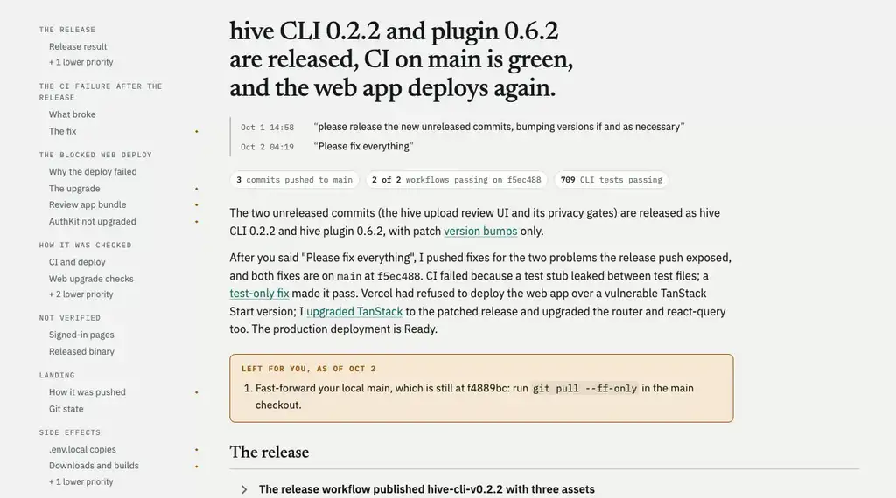

# debrief

Reviewing every single thing an agent did is no longer viable if you want to scale up the work you produce. `/debrief:debrief` turns a finished session into the review you need, on one page: what was done and why, the decisions with the highest risk of not being what you meant, the side effects, and how the work was verified. For fuzzy tasks without a solid test or metric, it's how you get quality without reading everything. Comment on it and ask for another round; the next round answers your comments and marks what's new since you last looked.

The page is a private claude.ai artifact. Requires `hive@alignment-hive` (hive CLI 0.2.0 or later) and `jq`.
